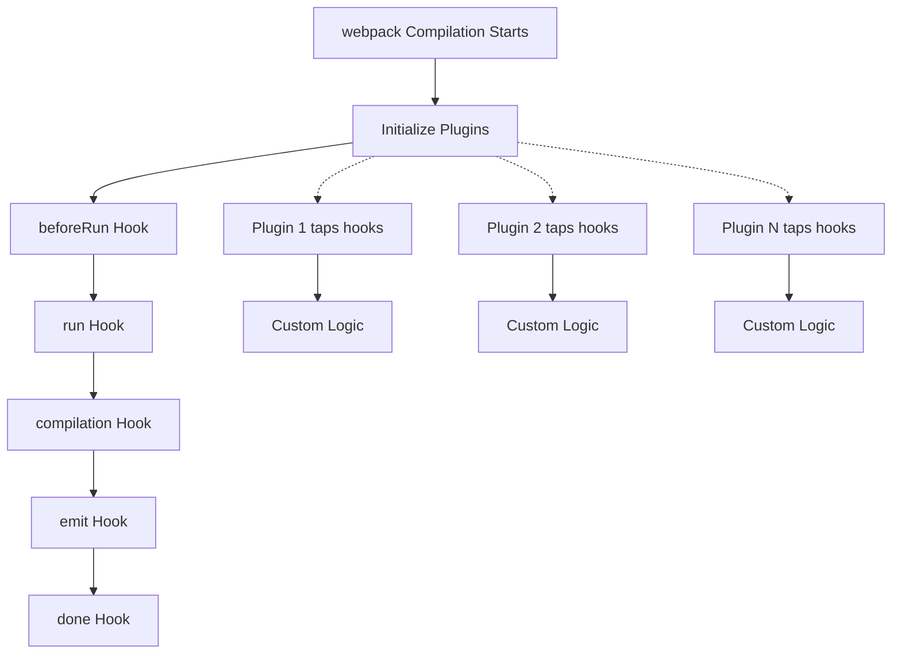

# Understanding webpack's Plugin System

webpack's plugin system is the heart of its extensibility. Built on [Tapable](https://github.com/webpack/tapable), a sophisticated event system, plugins allow you to hook into every stage of the compilation process and extend webpack's capabilities.

Think of webpack's compilation as a well-orchestrated symphony, where plugins act as conductors who can influence the performance at specific moments. Whether you want to optimize bundles, generate additional files, or modify the build process, plugins are your gateway to webpack's internals.

## How the Plugin System Works

At its core, webpack's plugin system follows the [Observer pattern](https://en.wikipedia.org/wiki/Observer_pattern). webpack emits events (called "hooks") at various stages of compilation, and plugins "tap" into these hooks to execute custom logic.

The beauty of this system lies in its predictability. webpack guarantees that hooks fire in a specific order, allowing plugins to work together harmoniously.

## Tapable: The Event System

webpack uses [Tapable](https://github.com/webpack/tapable) to manage its hook system. Tapable provides different types of hooks for different execution patterns:

**Synchronous hooks** execute plugins one after another, while **asynchronous hooks** can wait for promises or callbacks. Some hooks allow plugins to modify data (waterfall hooks), while others can short-circuit execution (bail hooks).

For a complete understanding of hook types, study the [Tapable documentation](https://github.com/webpack/tapable#hook-types) and examine how webpack uses them in practice.

## The Plugin Architecture

Every webpack plugin follows a simple contract: it must have an `apply` method that receives the compiler instance. This method is your plugin's entry point where you register your event listeners.

Let's examine how real webpack plugins implement this pattern by looking at some core examples:

**Simple synchronous plugin**: [DefinePlugin](https://github.com/webpack/webpack/blob/main/lib/DefinePlugin.js) replaces variables in your code at build time.

**Complex asynchronous plugin**: [HtmlWebpackPlugin](https://github.com/jantimon/html-webpack-plugin/blob/main/lib/html-webpack-plugin.js) generates HTML files and injects script tags.

**Asset processing plugin**: [MiniCssExtractPlugin](https://github.com/webpack/mini-css-extract-plugin) extracts CSS into separate files.

## Learning from Examples

To understand plugin development in practice, study the modern plugin example in our [examples directory](../../assets/examples/simple-plugin.js). This demonstrates:

- Modern ES6+ JavaScript syntax
- Proper hook registration and usage
- Asset processing and generation
- Option validation and defaults
- Real-world plugin patterns

The example shows how to build a bundle analyzer plugin that generates detailed reports about your webpack builds, following all current best practices.

## webpack's Core Components

Understanding webpack's main components helps you choose the right hooks and write effective plugins:

**[Compiler](https://github.com/webpack/webpack/blob/main/lib/Compiler.js)** manages the overall build lifecycle. It's where you'll find hooks like `beforeRun`, `run`, `compilation`, and `done`. Think of it as webpack's central nervous system.

**[Compilation](https://github.com/webpack/webpack/blob/main/lib/Compilation.js)** represents a single build with specific files and settings. Its hooks like `buildModule`, `seal`, and `processAssets` let you interact with individual modules and assets.

**[ModuleGraph](https://github.com/webpack/webpack/blob/main/lib/ModuleGraph.js)** tracks dependencies between modules, enabling optimizations like tree shaking and code splitting.

## Essential Hook References

Rather than memorizing hooks, familiarize yourself with webpack's comprehensive documentation:

- [Compiler Hooks API](https://webpack.js.org/api/compiler-hooks/) lists all compiler-level hooks with examples
- [Compilation Hooks API](https://webpack.js.org/api/compilation-hooks/) covers compilation-specific hooks
- [Plugin API Guide](https://webpack.js.org/contribute/writing-a-plugin/) from webpack's official docs

For deeper understanding, examine how webpack itself uses these hooks in its [core plugins directory](https://github.com/webpack/webpack/tree/main/lib).

## Performance Considerations

When writing plugins, keep performance in mind. webpack processes thousands of modules in large applications, so inefficient plugins can significantly impact build times.

**Avoid expensive operations** in frequently called hooks like `buildModule`. If you must perform heavy computations, consider [memoization](https://en.wikipedia.org/wiki/Memoization) or [lazy evaluation](https://en.wikipedia.org/wiki/Lazy_evaluation).

**Use appropriate hook types**. Don't use asynchronous hooks when synchronous ones suffice, as async hooks have additional overhead.

Study webpack's [performance optimization techniques](https://webpack.js.org/guides/build-performance/) and apply similar principles to your plugins.

## Testing Your Plugins

webpack's own test suite provides excellent examples of plugin testing patterns. Examine the [plugin tests directory](https://github.com/webpack/webpack/tree/main/test/plugins) to see how webpack tests its built-in plugins.

The key insight from webpack's approach is to test plugins by running actual webpack compilations and examining the results, rather than mocking extensively.

## Learning from the Ecosystem

The webpack ecosystem contains hundreds of plugins solving real-world problems. Study successful plugins to understand common patterns:

The webpack ecosystem contains hundreds of plugins solving real-world problems. Study successful plugins to understand common patterns:

**[awesome-webpack](https://github.com/webpack-contrib/awesome-webpack)** curates community plugins and resources.

When studying existing plugins, pay attention to how they handle errors, validate options using [schema-utils](https://github.com/webpack/schema-utils), and interact with other plugins.

## Common Plugin Patterns

**Asset transformation**: Plugins often process assets during the `processAssets` hook. Study [TerserPlugin](https://github.com/webpack/terser-webpack-plugin) for JavaScript minification patterns.

**Code analysis**: Many plugins analyze the module graph to make optimizations. [webpack-bundle-analyzer](https://github.com/webpack/webpack-bundle-analyzer) provides excellent examples.

**File generation**: Plugins frequently generate additional files. [HtmlWebpackPlugin](https://github.com/jantimon/html-webpack-plugin) demonstrates sophisticated template processing.

## Error Handling

webpack provides [WebpackError](https://github.com/webpack/webpack/blob/main/lib/WebpackError.js) for consistent error reporting. Use this class for plugin-specific errors to ensure they display properly in webpack's output.

Always handle errors gracefully in asynchronous hooks, and provide meaningful error messages that help developers debug issues.

## Next Steps

Start by studying webpack's [plugin writing guide](https://webpack.js.org/contribute/writing-a-plugin/) and examining the source code of plugins that interest you. Create simple plugins to understand the compilation lifecycle, then gradually tackle more complex scenarios.

The webpack plugin system is powerful but approachable once you understand its patterns. Every webpack feature you use daily—from code splitting to asset optimization—is implemented through this same plugin system you're learning to master.
