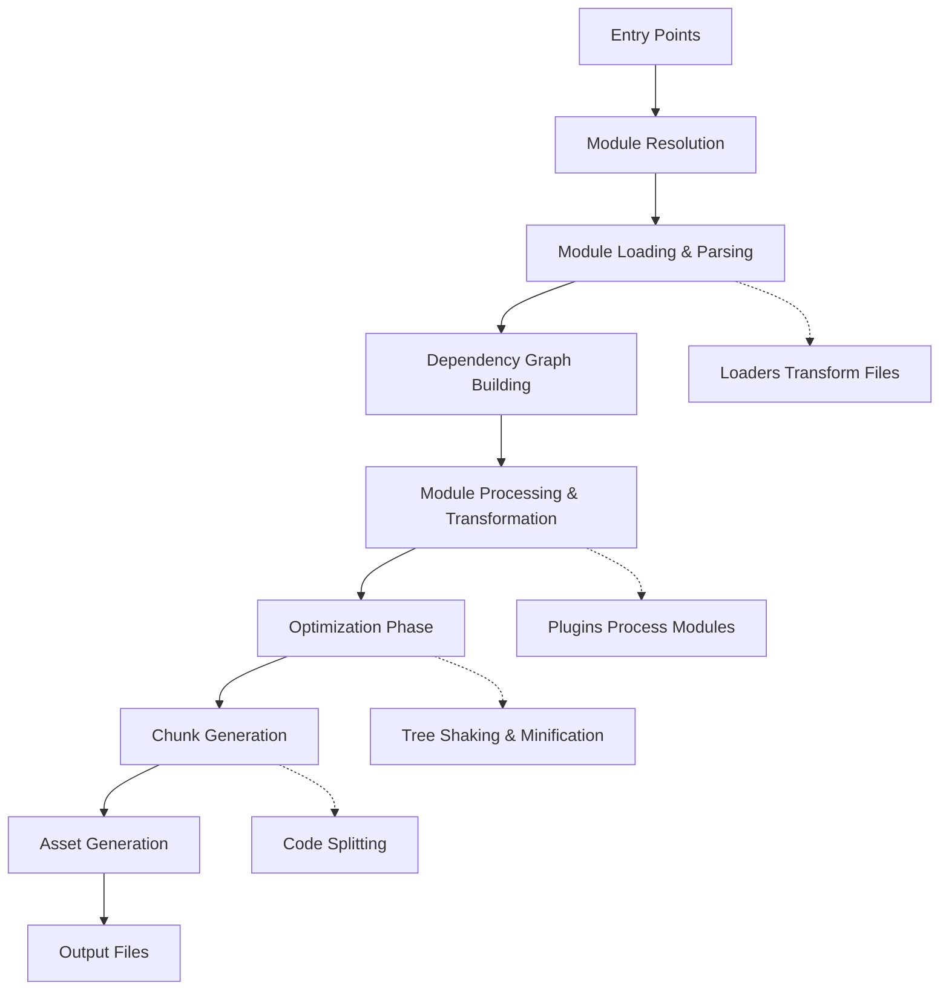
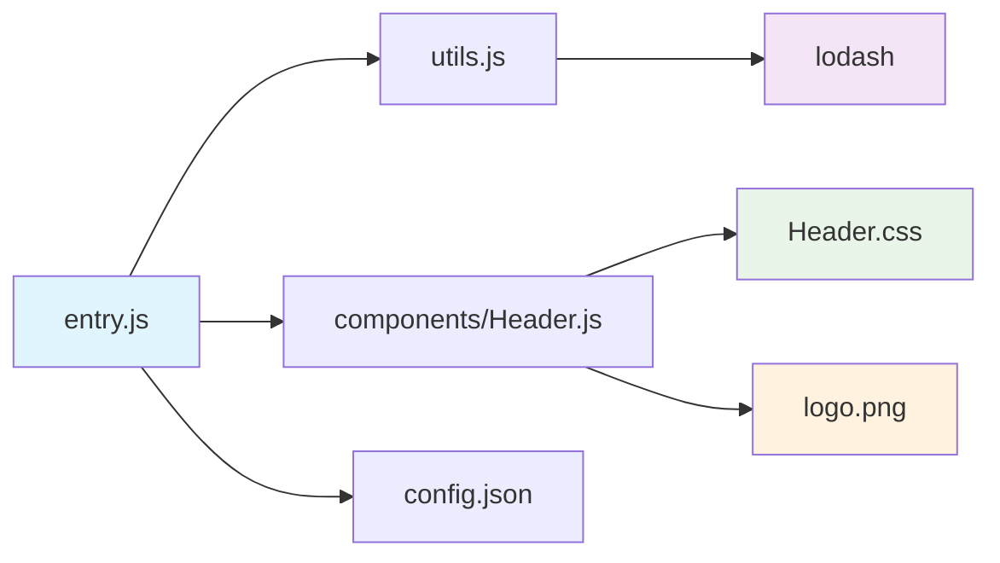
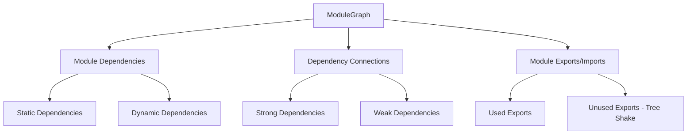
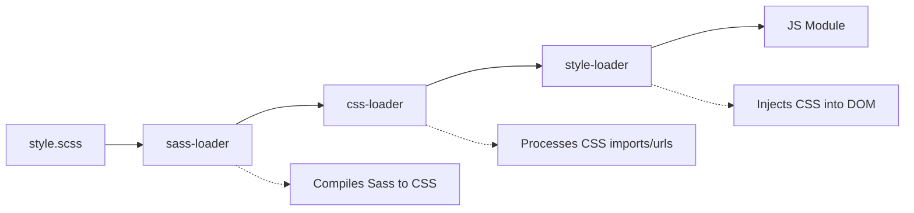
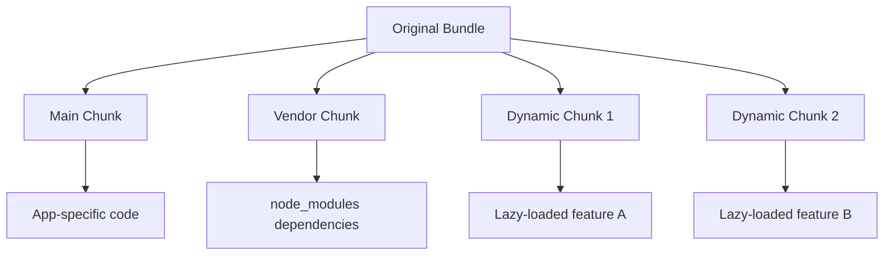

# webpack Architecture Deep Dive

Understanding webpack's internal architecture is essential for effective contribution. This guide explores how webpack processes your code from entry to output, the key components involved, and how they work together to create optimized bundles.

webpack is fundamentally a **static module bundler**. It analyzes your project's dependency graph starting from entry points and generates optimized bundles containing all necessary code.

## The Build Process Flow

webpack's compilation follows a predictable sequence of phases, each with specific responsibilities:



This flow happens every time you run webpack, whether in development or production mode. Understanding this sequence helps you know where to hook in with plugins or loaders.

### Initialization Phase

webpack starts by parsing your configuration and creating the main [Compiler](https://github.com/webpack/webpack/blob/main/lib/Compiler.js) instance. This compiler acts as webpack's central nervous system, orchestrating the entire build process.

During initialization, webpack also sets up its plugin system by calling each plugin's `apply` method, allowing plugins to register their event listeners.

### Build Phase

The build phase begins when webpack encounters your entry points. For each entry, webpack starts building a dependency graph by resolving modules and their dependencies.



webpack uses [enhanced-resolve](https://github.com/webpack/enhanced-resolve) to handle module resolution, following Node.js resolution rules with extensions for things like aliases and custom extensions.

### Seal Phase

After building the module graph, webpack "seals" the compilation and begins optimization. This is where tree shaking, module concatenation (scope hoisting), and other optimizations happen.

The [SplitChunksPlugin](https://github.com/webpack/webpack/blob/main/lib/optimize/SplitChunksPlugin.js) also runs during this phase, analyzing the module graph to determine optimal chunk splitting strategies.

### Emit Phase

Finally, webpack generates the actual output files and writes them to the filesystem. This includes creating source maps if configured and running any final asset processing plugins.

## Core Components

### Compiler

The [Compiler](https://github.com/webpack/webpack/blob/main/lib/Compiler.js) manages the entire build lifecycle. It provides hooks like `beforeRun`, `run`, `compilation`, `emit`, and `done` that plugins use to extend webpack's functionality.

Think of the Compiler as webpack's event emitter - it coordinates the build process and notifies plugins when significant events occur.

### Compilation

A [Compilation](https://github.com/webpack/webpack/blob/main/lib/Compilation.js) represents a single build with a specific set of resources. While the Compiler manages multiple compilations (like in watch mode), each Compilation handles the processing of modules for one build.

The Compilation object contains:
- All modules being processed
- The dependency graph
- Generated chunks
- Assets to be emitted

### Module Graph

The [ModuleGraph](https://github.com/webpack/webpack/blob/main/lib/ModuleGraph.js) tracks dependencies between modules and enables sophisticated optimizations. It's separate from the modules themselves, allowing webpack to analyze relationships without duplicating module data.



This separation allows webpack to perform advanced optimizations like tree shaking without modifying the original module representations.

## Module Resolution Deep Dive

webpack's module resolution is handled by [enhanced-resolve](https://github.com/webpack/enhanced-resolve), which extends Node.js resolution with webpack-specific features.

The resolution process follows these steps:

1. **Parse the request** - Extract module name, path, and query parameters
2. **Apply aliases** - Check if the request matches any configured aliases
3. **Try extensions** - Append extensions like `.js`, `.json`, `.ts` until a file is found
4. **Check main fields** - Look for `main`, `module`, `browser` fields in package.json
5. **Resolve** - Return the final resolved path

webpack caches resolution results for performance, which is why changes to `node_modules` sometimes require clearing webpack's cache.

## Loaders and Transformations

Loaders transform files before they're processed by webpack. They run in reverse order (right to left) and can be chained together:



Each loader receives the output of the previous loader and must return JavaScript code or pass the result to the next loader.

Popular loaders include [babel-loader](https://github.com/babel/babel-loader) for JavaScript transformation, [css-loader](https://github.com/webpack/css-loader) for CSS processing, and webpack's asset modules for asset handling.

## Plugin System Architecture

webpack's plugin system is built on [Tapable](https://github.com/webpack/tapable), which provides various hook types following the [Observer pattern](https://en.wikipedia.org/wiki/Observer_pattern).

```mermaid
graph TD
    A[webpack Compiler] --> B[Tapable Hooks]
    B --> C[SyncHook]
    B --> D[AsyncSeriesHook]
    B --> E[AsyncParallelHook]
    B --> F[SyncWaterfallHook]

    C --> G[Plugins tap synchronously]
    D --> H[Plugins tap with promises/callbacks]
    E --> I[Plugins run in parallel]
    F --> J[Plugins modify data in sequence]

    G --> K[Execution: plugin1 → plugin2 → plugin3]
    H --> L[Execution: await plugin1 → await plugin2]
    I --> M[Execution: Promise.all([plugin1, plugin2])]
    J --> N[Execution: data → plugin1 → plugin2 → result]
```

This system allows plugins to run at precisely the right moments in webpack's lifecycle, from initial configuration parsing to final asset emission.

## Optimization Strategies

webpack applies numerous optimizations to reduce bundle size and improve runtime performance:

### Tree Shaking

Tree shaking eliminates unused code by analyzing ES6 import/export statements. webpack marks unused exports during compilation and removes them during minification.

The process relies on static analysis, so it works best with ES6 modules rather than CommonJS. Libraries like [Lodash](https://lodash.com/) provide ES6 versions specifically to enable better tree shaking.

### Code Splitting

webpack automatically splits code into chunks based on several strategies:

**Entry point splitting** - Each entry point becomes a separate chunk
**Dynamic imports** - `import()` statements create separate chunks
**SplitChunks optimization** - Shared dependencies are extracted into vendor chunks



### Module Concatenation

Also known as "scope hoisting," this optimization combines modules into fewer scopes to reduce function call overhead and enable better minification.

The [ModuleConcatenationPlugin](https://github.com/webpack/webpack/blob/main/lib/optimize/ModuleConcatenationPlugin.js) analyzes which modules can be safely concatenated without affecting behavior.

## Development vs Production

webpack behaves differently in development and production modes to optimize for different priorities:

**Development mode** prioritizes fast rebuilds and debugging capabilities:
- Minimal optimizations for faster builds
- Source maps for easier debugging
- Hot Module Replacement for live updates
- Detailed error messages and warnings

**Production mode** focuses on optimal bundle size and runtime performance:
- Full optimization pipeline including minification
- Advanced tree shaking and dead code elimination
- Optimal chunk splitting for caching
- Compressed output and minimal error messages

## Memory and Performance Considerations

webpack can consume significant memory during compilation, especially for large projects. Key factors affecting performance include:

**Module resolution caching** - webpack caches resolution results, but too many files can consume memory

**Webpack Dev Server** uses an in-memory filesystem for faster rebuilds during development

**Parallel processing** - webpack uses worker pools for CPU-intensive tasks like minification

Study webpack's [build performance guide](https://webpack.js.org/guides/build-performance/) for detailed optimization strategies.

## Integration Points

### File System Abstraction

webpack abstracts file system operations through a unified interface, allowing it to work with different filesystem implementations including in-memory filesystems for testing.

See [webpack's filesystem utilities](https://github.com/webpack/webpack/tree/main/lib/util/fs.js) for implementation details.

### Module Formats

webpack supports multiple module formats and can transform between them:

- **ES6 Modules** (`import`/`export`) - Preferred for tree shaking
- **CommonJS** (`require`/`module.exports`) - Node.js standard
- **AMD** (`define`/`require`) - Asynchronous Module Definition
- **System.js** - Universal module loader

The [webpack module parsers](https://github.com/webpack/webpack/tree/main/lib/javascript) handle parsing and transformation between these formats.

## Runtime Architecture

webpack generates a runtime that manages module loading and execution in the browser:

```mermaid
graph TD
    A[webpack Runtime] --> B[Module Cache]
    A --> C[Chunk Loading]
    A --> D[Module Resolution]

    B --> E[Prevents duplicate loading]
    C --> F[Dynamic import() handling]
    D --> G[Module ID to function mapping]

    F --> H[fetch() for chunks]
    F --> I[JSONP for legacy support]
    F --> J[import() for modern browsers]
```

The runtime size depends on features used - basic bundling has minimal runtime overhead, while features like code splitting add more runtime code.

Examine [webpack's runtime templates](https://github.com/webpack/webpack/tree/main/lib/runtime) to understand how different features affect runtime size.

## Debugging webpack

Understanding webpack's internal state helps debug complex build issues:

**Enable detailed stats** with `webpack --stats verbose` to see detailed compilation information

**Use webpack-bundle-analyzer** to visualize bundle composition and identify optimization opportunities

**Examine webpack's internal state** by adding logging to plugins or using Node.js debugging tools

The [webpack CLI debugging options](https://webpack.js.org/api/cli/#debug-options) provide various flags for troubleshooting build issues.

## Contributing to webpack Core

When contributing to webpack itself, focus on these key areas:

**Performance impact** - Profile your changes to ensure they don't slow down builds significantly

**Backward compatibility** - webpack maintains extensive backward compatibility for existing projects

**Test coverage** - Add tests that cover both successful scenarios and error conditions

**Documentation** - Update relevant documentation for user-facing changes

webpack's architecture has evolved over many years to handle the complexity of modern web applications while maintaining performance and extensibility. Understanding these patterns will help you contribute effectively and build better tools on top of webpack's foundation.
